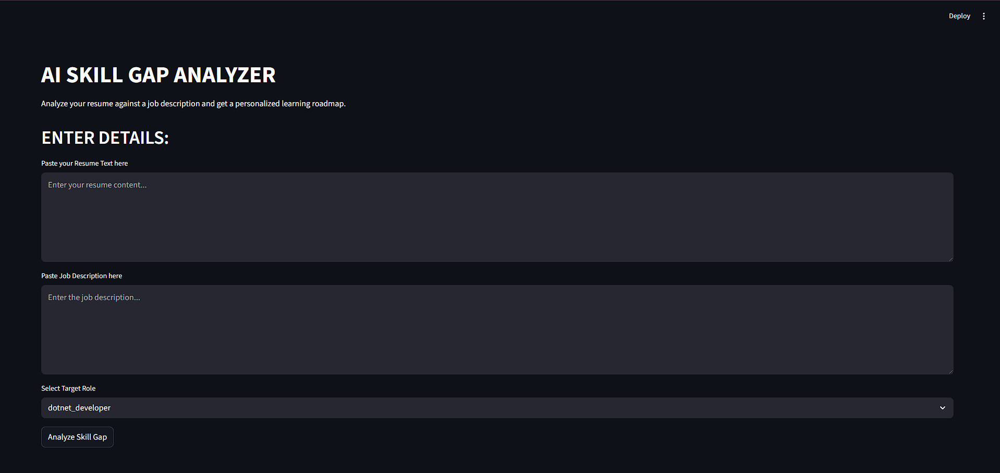

# Skill Gap Analyzer (Resume vs Job Description)

A semantic skill‑extraction and gap‑analysis tool that compares a resume against a job description, identifies missing skills, and generates a learning roadmap with skill dependencies and resources.

## Features
- Sentence‑level semantic skill extraction
- Ontology + alias + regex normalization
- Missing skill detection
- Learning roadmap with prerequisites and resources
- Streamlit UI

## Tech Stack
- Python
- Sentence Transformers
- Scikit‑Learn
- Streamlit

## Run
pip install -r requirements.txt
streamlit run app.py

## Roadmap
- Role‑aware skill weighting
- Hierarchical skill inference
- TF‑IDF + embedding hybrid extractor



## Run Locally
```bash
git clone https://github.com/HarshSrivastava10/skill-gap-analyzer.git
cd project-folder

python -m venv venv
venv\Scripts\activate # WINDOWS

# or

source venv/bin/activate # LINUX/MAC

pip install --r requirements.txt
streamlit run app.py

```

### Future Enhancements
- Role‑aware weighting
- TF‑IDF + embedding hybrid model
- Export results as PDF
- Docker support for easy deployment


AUTHOR - HARSH SRIVASTAVA
